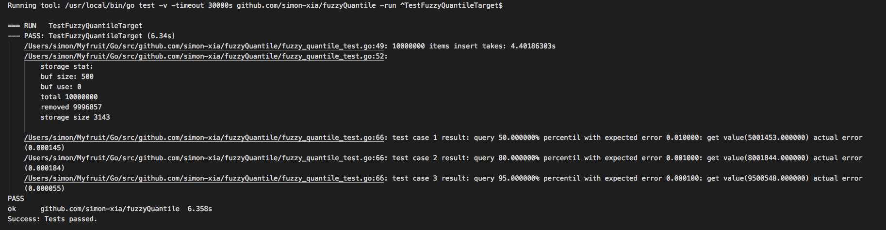

# FuzzyQuantile

[](https://godoc.org/github.com/simon-xia/fuzzyQuantile)
[](https://goreportcard.com/report/github.com/simon-xia/fuzzyQuantile)

High performance quantile estimation(e.g. 90th, 95th, 99th) over unbounded streaming data, within expected error (e.g 0.1%) and low memory usage. 

This is an implementation of the algorithm presented in [Cormode, Korn, Muthukrishnan, and Srivastava. "Effective Computation of Biased Quantiles over Data Streams"](https://www.cs.rutgers.edu/~muthu/bquant.pdf) in ICDE 2005.


# Install

```
go get github.com/simon-xia/fuzzyQuantile
```

# Benchmark

On my laptop (MacBook Pro 15-inch Mid 2015, 2.2 GHz Intel Core i7), run the test case [TestFuzzyQuantileTarget](https://github.com/simon-xia/fuzzyQuantile/blob/master/fuzzy_quantile_test.go#L36). Inserted 10 M values takes 4.04s, only 3143 values were stored, which means 99.96857% value were dropped. And quantile query error were all as expected.



# Usage


This example show target quantile estimation. Given a set of Quantiles, each Quantile instance repsent a pair (quantile, error) which means expected quantile value with the error. And query will give the result quantile value corresponding error.

```go
testQuantiles := []Quantile{
	NewQuantile(0.5, 0.01),
	NewQuantile(0.8, 0.001),
	NewQuantile(0.95, 0.0001),
}

fq := NewFuzzyQuantile(&FuzzyQuantileConf{Quantiles: testQuantiles})

// valueChan repsent a data stream source
valueChan := make(chan float64)
for v := range valueChan {
	fq.Insert(v)
   }
   
// valueChan close at other place

v, er := fq.Query(0.8)
if er != nil {
	// handle error
}
log.Printf("success 80th percentile value %v", v)
```

For other usage, check the document or testcase in source code.

More details(Chinese): [无穷数据流的分位数问题](http://simonxia.com/%E6%97%A0%E7%A9%B7%E6%95%B0%E6%8D%AE%E6%B5%81%E7%9A%84%E5%88%86%E4%BD%8D%E6%95%B0%E9%97%AE%E9%A2%98/)

# TODO

- [ ] RBTree Storage Impl
- [ ] More graceful log
